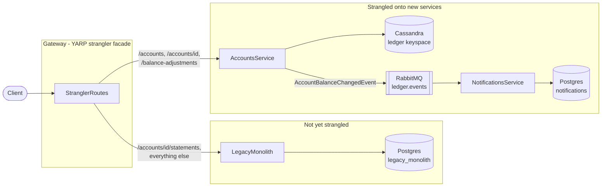

# ledger-strangler-platform

[](https://github.com/sahilkalgutkar/ledger-strangler-platform/actions/workflows/ci.yml)
[](https://codecov.io/gh/sahilkalgutkar/ledger-strangler-platform)
[](codecov.yml)
[](LICENSE)

I built this to work through a real strangler fig migration end to end, not just talk about one: a legacy core-banking monolith with a YARP facade in front of it, peeling routes off one at a time onto new services, without a big-bang rewrite or any downtime for the routes that haven't moved yet.

## The cut line

`LegacyMonolith` starts out owning two domains in one process against one Postgres database: Accounts and Statements. `Gateway` sits in front of it as the strangler facade - the single place that decides, per request path, which side of the migration a request belongs on:

- Account CRUD and balance adjustments are already strangled off to `AccountsService`, a new Cassandra-backed service that publishes a `AccountBalanceChangedEvent` to RabbitMQ on every balance change
- Statements haven't been strangled yet, so those requests still fall through to the legacy monolith, which still reads its own copy of account data to generate them

That's a deliberate, honest gap, not an oversight: an account created after the cutover has no statement history in the legacy database, because Statements is still reading local state the new service never writes to. Real strangler migrations live with exactly this kind of transitional inconsistency for however long it takes to get to the next domain - I didn't paper over it with a fake sync job.

`NotificationsService` is the first thing that only exists *because* of the migration: it consumes `AccountBalanceChangedEvent` off a durable RabbitMQ topic exchange and turns each one into a notification record. Nothing in the legacy monolith calls it directly - it reacts to an event the old code was never able to produce.



Every service ships structured JSON logs via Serilog to a shared volume; Filebeat tails them into Logstash into Elasticsearch, browsable in Kibana - one place to see a request's logs no matter which side of the cut it landed on.

## Deploying it

Terraform (`terraform/`) provisions the target Azure environment: an AKS cluster, an ACR for images, and a Log Analytics workspace that AKS's Container Insights ships to - the same workspace the application-level ELK logging could federate into. The AKS cluster's kubelet identity gets `AcrPull` granted directly on the registry instead of using ACR's admin credentials.

`deploy/k8s` is the whole cluster state, kustomize-buildable as one unit, and `deploy/argocd/application.yaml` is what actually applies it: an ArgoCD `Application` watching this repo's `deploy/k8s` path with automated sync and self-heal on. CI builds and pushes images to ACR; the manifests in git are what's actually running, not whatever someone last ran `kubectl apply` with.

Like the Terraform in my other repos, this describes the target infrastructure - it isn't kept running 24/7 against a live subscription.

## Running it locally

```bash
docker compose up --build
```

Brings up both Postgres instances, Cassandra, RabbitMQ, all four services, and the full ELK stack. Once everything's healthy:

```bash
# Create an account - routed to AccountsService (Cassandra)
curl -X POST http://localhost:5300/accounts \
  -H 'Content-Type: application/json' \
  -d '{"customerName":"Jane Doe","openingBalance":100}'

# Adjust its balance - publishes AccountBalanceChangedEvent to RabbitMQ
curl -X POST http://localhost:5300/accounts/<id>/balance-adjustments \
  -H 'Content-Type: application/json' \
  -d '{"delta":50}'

# The event lands as a notification a moment later
curl http://localhost:5302/notifications/<id>

# Statements still route to the legacy monolith
curl -X POST http://localhost:5300/accounts/<id>/statements \
  -H 'Content-Type: application/json' \
  -d '{"periodStart":"2026-01-01T00:00:00Z","periodEnd":"2026-01-31T00:00:00Z"}'
```

Kibana is at `http://localhost:5601`, RabbitMQ's management UI at `http://localhost:15672` (guest/guest).

## Testing it

Each service is tested at the level that actually proves something: EF Core InMemory for pure business logic, real Postgres/Cassandra/RabbitMQ via Testcontainers for anything that talks to infrastructure, and `WebApplicationFactory` for the HTTP layer itself - including one test that spins up two real fake downstream servers on real sockets to prove the Gateway's YARP routing actually forwards bytes to the right place, not just that the route table looks right on paper.

```bash
dotnet test
```

## Stack

.NET 8 / ASP.NET Core, YARP, Entity Framework Core, PostgreSQL, Cassandra (with lightweight transactions for compare-and-swap balance updates), RabbitMQ, Serilog, the ELK stack, Docker Compose, Terraform (`azurerm`), Kubernetes, ArgoCD, GitHub Actions, xUnit, Testcontainers.
